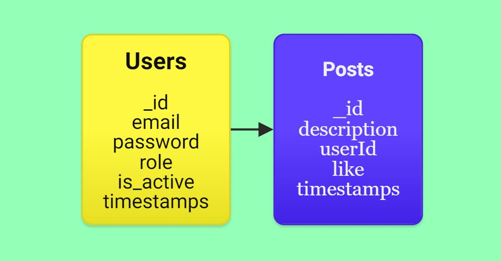

# SocialNetwork Backend🌐

Welcome to my SocialNetwork Backend project, I hope you like it! ✏️
<br><br>

</a>

<details>
  <summary>Table of Contents📝</summary>
  <ol>
 <li><a href="#description">Description</a></li>
    <li><a href="#objetive">Objetive</a></li>
    <li><a href="#deploy-">Deploy</a></li>
    <li><a href="#stack">Stack</a></li>
    <li><a href="#database-schema">Database Schema</a></li>
    <li><a href="#local-installation">Local installation</a></li>
    <li><a href="#endpoints">Endpoints</a></li>
    <li><a href="#future-functionalities️">Future functionalities</a></li>
    <li><a href="#development">Development</a></li>
    <li><a href="#appreciations">Appreciations</a></li>
    <li><a href="#contact">Contact</a></li>
  </ol>
</details>
<br>

## Description📚
This project consists of the development of a social network in which any user who does not have an account can register, log in and interact with other users through various options.<br>
We will be able to upload publications where we will be able to comment our day, mood, anything you want to share with others and other users will be able to like your publication to let you know their opinion.
We will have multiple options to view any content that is part of our application and to edit your profile or publications once created.


## Objetive🎯
The objetive of this project is to adapt to the work that Javascript does with non-relational databases and to get better and better with Javascript, Mongo DB, Express JS and Node.<br>
I have completed a list of endpoints and seeders, taking into account different roles with their respective permissions.

## Deploy 🚀
<div align="center">
    <a href="https://socialnetwork-backend.zeabur.app/"><strong> Click here! </strong></a>🚀🚀🚀
</div>

## Stack📒
Used technology:
<div align="center">
<a>
    
</a>
<a>
    
</a>
<a>
    
</a>
<a>
    
</a>
<a>

</a>
<a>
    
</a>
<a>
    
</a>
</div>


## Database Schema📋


    - "Users" to "Posts": One-to-many relationship where one users can have many posts.

## Local installation🧾
1. Install docker and create a Mongo DB container
``` docker run -d -p 27017:27017 --name mongo -v mongo_data:/data/db -e MONGO_INITDB_ROOT_USERNAME=root -e MONGO_INITDB_ROOT_PASSWORD=root mongo:latest   ```
2. Clone the repository
3.  ``` $ npm install  ```
4. We connect our repository with the database
5. ``` $ npm run dev ``` 
6. ``` $ We run the seeders $ npm run db:seed ``` 
7. ...


## Endpoints🧩
<details>
<summary>Authentication🔑</summary>

- **Register user**

          POST http://localhost:5000/api/auth/register

    body:

    ```js
        {
            "email": "david@david.com",
            "password": "123456789"
        }
    ```

<br>

- **Login user**	

          POST http://localhost:5000/api/auth/login

    body:

    ```js
        {
            "email": "david@david.com",
            "password": "123456789"
        }
    ```
</details>
<details>
<summary>Users🧑🏻</summary>

- **View all users** (IS ADMIN)

          GET http://localhost:5000/api/users

    auth:

    ```js
        auth token
    ```

<br>

- **View user profile**

          GET http://localhost:5000/api/users/profile

    auth:

    ```js
        auth token
    ```

<br>

- **Update user profile**

          PUT http://localhost:5000/api/users/profile

    body:

    ```js
        {
            "email": "nuno@nuno.com",
            "password": "123498765"
        }
    ```

    auth:

    ```js
        auth token
    ```

</details>
<details>
<summary>Posts🤳🏽</summary>

- **Create post** 

          POST http://localhost:5000/api/posts

    body:

    ```js
        {
            "description": "hello world"
        }
    ```

    auth:

    ```js
        auth token
    ```

<br>

- **Delete post**

          DLETE http://localhost:5000/api/posts/:id

    auth:

    ```js
        auth token
    ```

<br>

- **Update post**

          PUT http://localhost:5000/api/posts/:id

    body:

    ```js
        {
            "description": "update succesfully"
        }
    ```

    auth:

    ```js
        auth token
    ```

<br>

- **Get own posts**

          GET http://localhost:5000/api/posts/own

    auth:

    ```js
        auth token
    ```

<br>

- **Get all posts**

          GET http://localhost:5000/api/posts

    auth:

    ```js
        auth token
    ```

<br>

- **Get post by id**

          GET http://localhost:5000/api/posts/:id

    auth:

    ```js
        auth token
    ```

<br>

- **Get posts by a user** 

          GET http://localhost:5000/api/posts/users/:id-user

    auth:

    ```js
        auth token
    ```

<br>


- **Like and unlike post**

          PUT http://localhost:5000/api/posts/like/:id


    auth:

    ```js
        auth token
    ```
</details>


## Future functionalities⏭️
- Users will be able to have followers.
- The user will recover their timeline from the users they follow.
- ...


## Development👨🏻‍💻

```js
const developer = "DavidFernandez";

console.log("Developed by: " DavidFernandez);
```

## Appreciations💯

I would like to dedicate my thanks to the teachers at Geeks Hubs as well as my day to day peers with whom we can help each other with our problems.


## Contact📲
- **David Fernandez Valle**
  - [GitHub](https://github.com/Davfernandezz)
